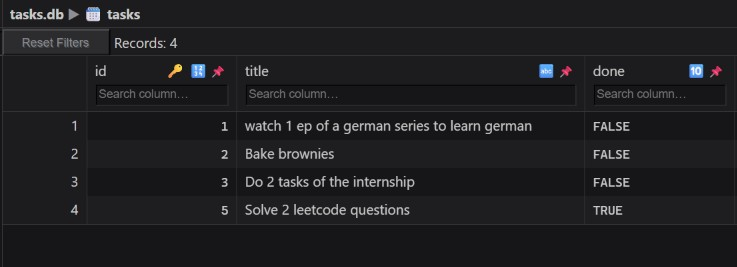
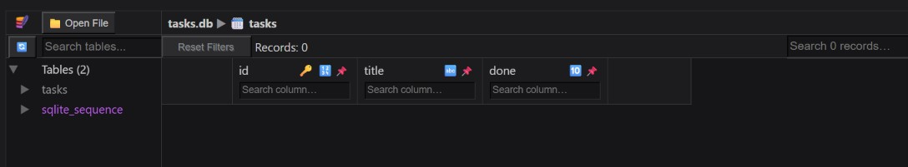

## Why I chose SQLite? 
I chose sqlite as this is a fairly simple project and using sqlite with python requires no extra installations. This project was just to show how to work with fastapi and a db together so a simple db was the right choice. 

## Where is the database file stored? 
The database file is stored in the folder itself. When you run the project for the first time the file is created automatically and 3 rows of data are added to it. 

## How to Start the project?  
1. Clone the project 
2. Run `pip install fastapi uvicorn pydantic` in a terminal in this folder 
3. In the terminal run `uvicorn main:app --reload` and the app will start running. The database will be created and 3 rows of data will be added the first time you run the app. 
4. Now you can try the following API endpoints in postman: 
    - GET http://127.0.0.1:8000/tasks 
    - GET http://127.0.0.1:8000/tasks/{id}
    - POST http://127.0.0.1:8000/task
    - PUT http://127.0.0.1:8000/toggleStatus/{id}
    - DELETE http://127.0.0.1:8000/deleteTask/{id}  

## Example Queries Executed in Last stage: 
`UPDATE tasks SET done = 1;` 
`DELETE FROM tasks WHERE done = 1;`

## Screenshots 
### Database before manual deletion in last stage: 
 

### Database after manual deletion in last stage: 
  

