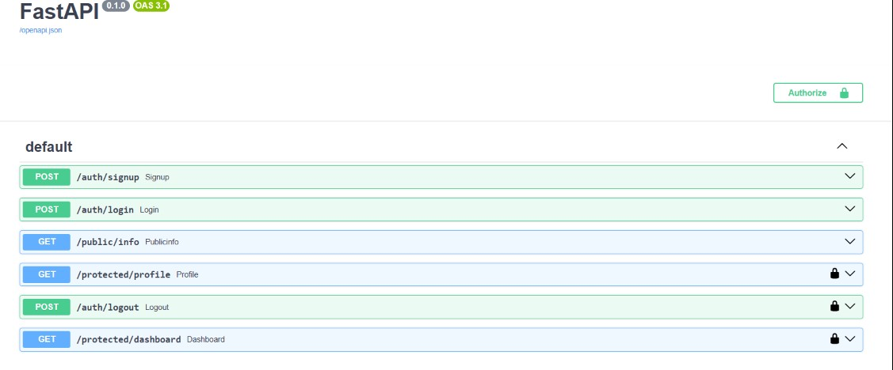

<h2>How to run it?</h2>

<ol>
  <li>Clone the repository.</li>

  <li>Create and activate a Python virtual environment.</li>

  <li>Create a <code>.env</code> file in the project root and add your Supabase credentials:
    <pre><code>SUPABASE_URL=your_supabase_url
SUPABASE_KEY=your_supabase_anon_key</code></pre>
  </li>

  <li>Start the FastAPI server:
    <pre><code>uvicorn main:app --reload --port 3000</code></pre>
  </li>

  <li>Open your browser and visit:
    <pre><code>http://localhost:3000/docs</code></pre>
    to access the automatically generated Swagger UI.
  </li>

  <li>Use the <strong>/auth/signup</strong> endpoint to create an account (if needed), then <strong>/auth/login</strong> to obtain an access token.</li>

  <li>Click the <strong>Authorize</strong> button in Swagger UI, paste your JWT access token, and test the protected endpoints such as <strong>/protected/profile</strong>.</li>
</ol>

<h2>Swagger UI showing my routes:</h2>

